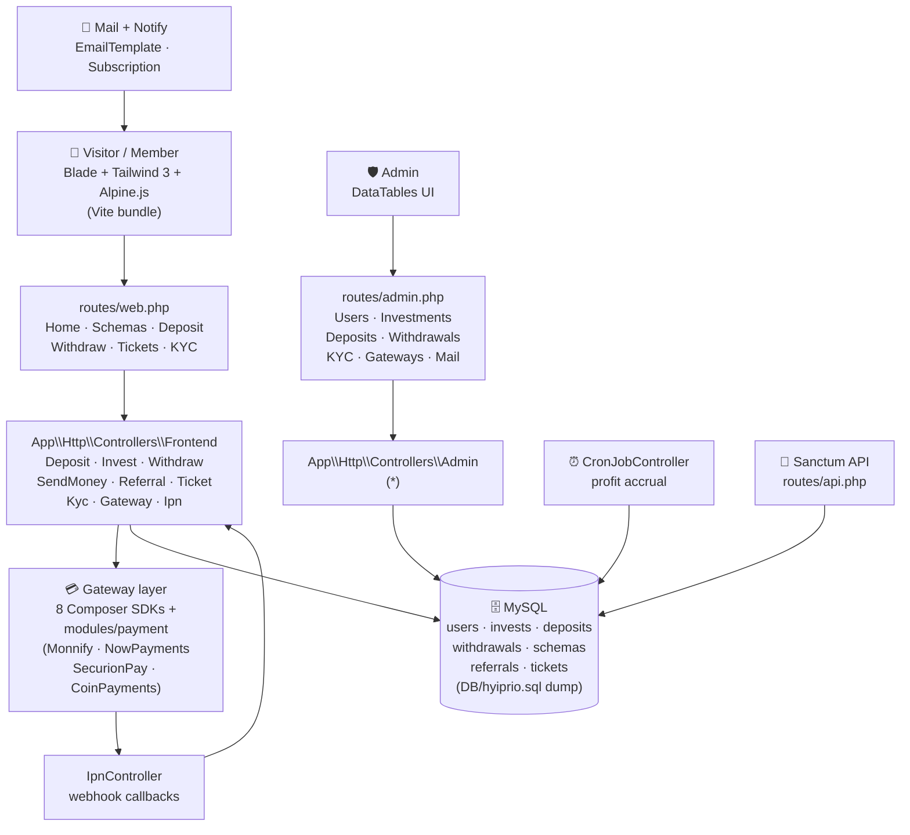

<p align="center">
  
</p>

<p align="center">
  
  
  
  
  
  
  
</p>

> **Developed by [Arslan Malik](https://github.com/arsalanmaalik461)**
> 📱 WhatsApp: [+92 300 8987448](https://wa.me/923008987448) · 🌐 Website: [arslanmalik.tech](https://arslanmalik.tech)

---

## 🌟 Executive Overview

**V1** (codebase name `hyiprio`) is a complete investment-program web application built on **Laravel 9** and **PHP 8.1+**. It implements the full lifecycle of an HYIP-style investment platform: visitors browse investment plans ("schemas") and a marketing landing site, members register with email verification and optional Google 2FA, fund their wallet through one of **twelve integrated payment gateways** (cards, banks, and crypto), purchase investment plans, earn scheduled profits, and withdraw — with withdrawals gated behind a KYC approval step.

Everything around the money flow is built in: a **multi-level referral engine** with referral targets, level commissions, and public rankings; **P2P send-money** and **wallet exchange** between members; a **support ticket system**; a **blog** and a full **landing-page CMS** (sections, menus, custom CSS, email templates, multiple languages). The admin side is a large control center (`routes/admin.php`) covering users, investments, deposits, withdrawals, KYC reviews, gateway configuration, rankings, email templates, subscriber mailings, and plugin management.

The frontend is server-rendered Blade with **Tailwind CSS 3** and **Alpine.js**, bundled by **Vite**; a small Sanctum-protected API exists alongside the web routes. The repo ships shared-hosting friendly (`index.php` + `.htaccess` at the document root) and includes a full database dump at `DB/hyiprio.sql` for one-step setup.

---

## 📑 Table of Contents

- [✨ Key Features & Highlights](#-key-features--highlights)
- [🖥️ Feature Showcase](#️-feature-showcase)
- [🏗️ System Architecture](#️-system-architecture)
- [🚀 Quickstart & Installation Guide](#-quickstart--installation-guide)
- [📂 Project Structure](#-project-structure)
- [🛡️ Security & Notes](#️-security--notes)

---

## ✨ Key Features & Highlights

| Feature | Description |
| :--- | :--- |
| 📈 Investment plans (schemas) | Admin-defined plans in `Schema`; members preview (`schema-preview/{id}`) and purchase with one click (`invest-now`), with per-plan invest logs |
| 💳 12 payment gateways | Stripe, PayPal, CoinGate, Coinbase, PerfectMoney, Flutterwave, Paystack, Mollie via Composer + Monnify, NowPayments, SecurionPay, CoinPayments in `modules/payment`; IPN/webhook handling in `IpnController` |
| 🏦 KYC-gated withdrawals | Withdrawals require approved KYC (`KYC` middleware); admin configures withdraw methods, member accounts, and withdrawal schedules |
| 💸 Wallets & transfers | Member wallet, P2P send-money (`send-money`), and wallet exchange (`wallet-exchange`) between members |
| 🤝 Multi-level referrals | Referral links, multi-level commission structure (`LevelReferral`), referral programs/targets, and public member rankings |
| 🎫 Support tickets | Full ticket lifecycle — open, reply, view by UUID, close — for members and admins (`coderflex/laravel-ticket` + custom controllers) |
| 🔐 2FA & verification | Google Authenticator 2FA (`pragmarx/google2fa`), email verification toggle, active-account checks, Spatie roles/permissions |
| 📰 Landing CMS + blog | Editable landing sections, navigation menus, custom CSS, email templates, blog posts, subscriber newsletter, multi-language via `joedixon/laravel-translation` |
| 🧮 Scheduled profit accrual | `CronJobController` + `Schedule` model drive time-based investment profit crediting |
| 🗄️ One-step database setup | Complete MySQL dump at `DB/hyiprio.sql` alongside standard Laravel migrations/seeders |
| 🛠️ Admin control center | Dashboard, users, investments, deposits, withdrawals, KYC, gateways, rankings, mail, menus, languages, plugins, one-click cache clear |

---

## 🖥️ Feature Showcase

### 1. 💳 Multi-Gateway Deposit Engine

> "Twelve ways to fund a wallet — cards, banks, and crypto, all behind one deposit flow."

- Eight gateways via Composer packages: `stripe/stripe-php`, `srmklive/paypal`, `coingate/coingate-php`, `shakurov/coinbase`, `charlesassets/laravel-perfectmoney`, `flutterwavedev/flutterwave-v3`, `unicodeveloper/laravel-paystack`, `mollie/laravel-mollie`
- Four more in `modules/payment/` (classmap-autoloaded): Monnify, NowPayments, SecurionPay (full SDK), CoinPayments (full SDK + examples)
- `GatewayController` renders the per-gateway payment step (`deposit/gateway/{code}`); `IpnController` receives gateway callbacks and credits deposits
- Every deposit is logged (`deposit/log`) and surfaced in the member's transaction history

### 2. 📈 Investment Plans & Profit Scheduling

> "Plans you can browse, buy, and watch — with profits credited on a schedule."

- `Schema` model + `SchemaController`: members browse plans (`user/schemas`), preview returns (`schema-preview/{id}`), and invest (`invest-now`)
- `Invest` records track principal, profit, and status per member; `invest-logs` gives the full history
- `CronJobController` and the `Schedule` model handle time-based profit accrual so earnings post automatically
- Admins manage plans, monitor all investments, and review profit payouts from the control center

### 3. 🏦 Withdrawals, KYC & Member Money

> "Withdrawals only after KYC — accounts, methods, and schedules under admin control."

- Withdrawal routes sit behind the `KYC` middleware: members must submit and get KYC documents approved first (`KycController`)
- Members register multiple withdraw accounts (`withdraw/account` resource), pick a method, and request payouts with a full withdraw log
- `WithdrawMethod`, `WithdrawAccount`, and `WithdrawalSchedule` models let admins define payout methods, limits, and timing
- Bonus flows: P2P `send-money` between members and `wallet-exchange` for moving balances

### 4. 🤝 Referrals, Rankings & Admin Control Center

> "A referral engine with levels, targets, and leaderboards — plus an admin panel that sees everything."

- Referral graph models: `Referral`, `ReferralLink`, `ReferralRelationship`, `ReferralProgram`, `ReferralTarget`, `LevelReferral` — multi-level commissions with configurable levels and targets
- Public `rankings` page and `Ranking` model turn top referrers into social proof
- Admin panel (`routes/admin.php`, ~12 KB of routes): dashboard, user management + balance adjustments, investments, deposits (auto + manual), withdrawals, KYC reviews, gateway enable/config, email templates, subscriber mailings, menus, landing content, languages, custom CSS, plugins, and cache clearing
- DataTables-powered listings (`yajra/laravel-datatables-oracle`) keep large admin tables fast

---

## 🏗️ System Architecture



**How it works:** Members interact with server-rendered Blade pages (Tailwind/Alpine, built with Vite). Controllers orchestrate deposits through the gateway layer — external payment pages or APIs — and `IpnController` finalizes deposits from gateway webhooks. Investments accrue profit via scheduled cron runs against the `Schedule` model. Withdrawals are held until KYC approval, and every money movement lands in `transactions` plus the admin's DataTables views. A Sanctum-guarded API exposes select endpoints alongside the web UI.

---

## 🚀 Quickstart & Installation Guide

### Prerequisites

- **PHP** 8.1+ with `ext-curl` (plus standard Laravel extensions: BCMath, Ctype, JSON, Mbstring, OpenSSL, PDO, Tokenizer, XML)
- **Composer** 2.x, **MySQL** 5.7+/8.x, **Node.js** 16+ with npm
- A web server (Apache/Nginx) or `php artisan serve` for local development

### Step-by-Step Installation

```bash
# 1. Clone the repository
git clone https://github.com/arsalanmaalik461/v1.git
cd v1

# 2. Install PHP dependencies
composer install

# 3. Configure the environment
cp .env.example .env
php artisan key:generate
# Edit .env: DB_DATABASE, DB_USERNAME, DB_PASSWORD,
# mail settings, and each gateway's API keys/secrets

# 4. Import the database (pick ONE)
mysql -u root -p your_database < DB/hyiprio.sql
# — or run the Laravel way —
php artisan migrate --seed

# 5. Finalize
php artisan storage:link
npm install && npm run build
```

Serve it with `php artisan serve` (dev) or point your web server at the project — the repo ships `index.php` + `.htaccess` at the root for shared-hosting layouts.

### Scheduled Tasks (required for profit accrual)

```bash
* * * * * cd /path/to/v1 && php artisan schedule:run >> /dev/null 2>&1
```

> **Note:** Gateway credentials live in `.env` / gateway settings — never commit them. Start with sandbox/test keys for every gateway and confirm IPN callbacks reach your server before accepting real deposits.

---

## 📂 Project Structure

```
v1/
├── DB/
│   └── hyiprio.sql              # Full MySQL dump for one-step setup
├── app/
│   ├── Console/                 # Artisan commands & scheduler
│   ├── Http/Controllers/
│   │   ├── Admin/               # Admin control-center controllers
│   │   └── Frontend/            # Member-facing: Deposit, Invest, Withdraw,
│   │                            # SendMoney, Referral, Ticket, Kyc, Gateway, Ipn...
│   ├── Models/                  # User, Invest, Schema, Gateway, Deposit,
│   │                            # Withdrawal*, Referral*, Ticket, Kyc, Ranking...
│   ├── Enums/ Facades/ Jobs/ Listeners/ Mail/ Providers/ Rules/ Traits/ View/
│   └── helpers.php              # Global helpers (autoloaded via composer files)
├── modules/
│   └── payment/                 # Extra gateway SDKs (classmap autoload)
│       ├── Monnify/  Nowpayments/  SecurionPay/  coinpayments/
├── config/                      # Laravel config (gateways, services, auth...)
├── database/                    # Migrations, factories, seeders
├── resources/
│   ├── views/                   # Blade templates (frontend + admin)
│   ├── js/  css/  lang/         # Vite entry points, Tailwind, translations
├── routes/
│   ├── web.php                  # Member routes (dashboard, deposit, invest...)
│   ├── admin.php                # Admin control-center routes
│   ├── api.php                  # Sanctum API routes
│   └── auth.php                 # Breeze authentication routes
├── assets/                      # Theme assets
├── storage/  bootstrap/  tests/
├── index.php  .htaccess         # Shared-hosting document-root entry
├── artisan
├── composer.json                # Laravel 9 · PHP ^8.1 · 12 payment gateways
├── package.json                 # Tailwind 3 · Alpine.js · Vite · axios
├── vite.config.js  tailwind.config.js  postcss.config.js
└── phpunit.xml  phpstan.neon    # Tests & static analysis config
```

---

## 🛡️ Security & Notes

- **Regulatory reality check** — this codebase implements an HYIP-style investment program. Promising fixed investment returns without a license is illegal in many jurisdictions and such platforms are frequently associated with fraud. Anyone deploying it is solely responsible for legal and financial compliance; the code documents what the software does, not permission to operate it.
- **Secrets stay in `.env`** — database, mail, and all gateway API keys/secrets must live in `.env`, which is git-ignored. Never commit real credentials, and rotate `APP_KEY` on every fresh install.
- **Change default admin credentials** immediately after importing `DB/hyiprio.sql` or seeding, and enable Google 2FA (included via `pragmarx/google2fa`) on all admin accounts.
- **Verify gateway webhooks** — treat every IPN callback as untrusted until its signature/payload is validated against the gateway's docs; log and reconcile callbacks against your own records.
- **KYC before payouts** — the code gates withdrawals behind KYC approval (`KYC` middleware); keep that gate enabled and review documents manually.
- **Cron is load-bearing** — without the scheduler entry above, investment profits never accrue; monitor it.
- **Dependency age** — the stack pins Laravel 9 (end-of-life) and 2022-era packages. Run `composer audit` / `npm audit` and plan an upgrade path before any production use.
- **Sanitize output** — user content passes through `mews/purifier`; keep it configured and don't render raw user HTML anywhere new.

---

<p align="center">
  <sub>Developed with ❤️ by <a href="https://github.com/arsalanmaalik461">Arslan Malik</a> · 📱 <a href="https://wa.me/923008987448">WhatsApp: +92 300 8987448</a> · 🌐 <a href="https://arslanmalik.tech">arslanmalik.tech</a></sub>
</p>
